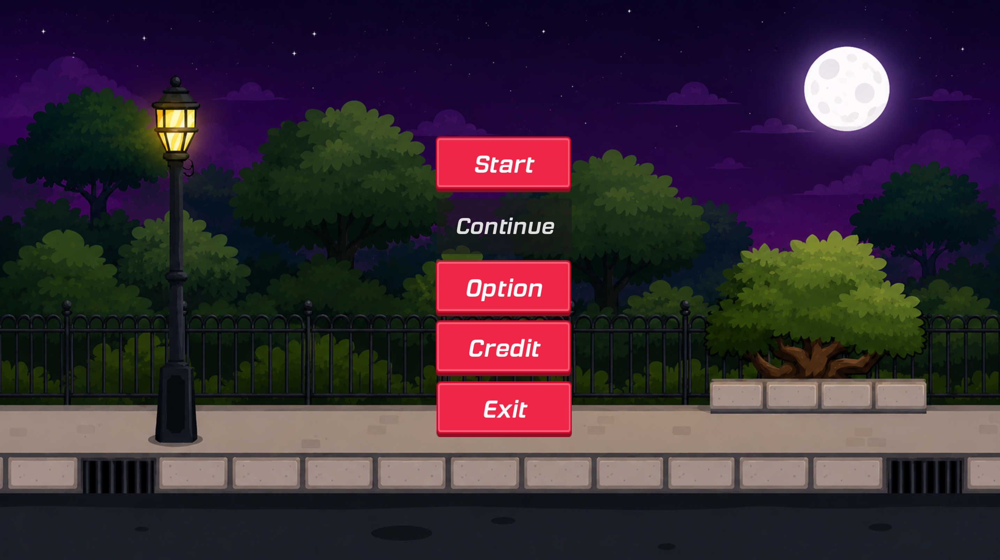
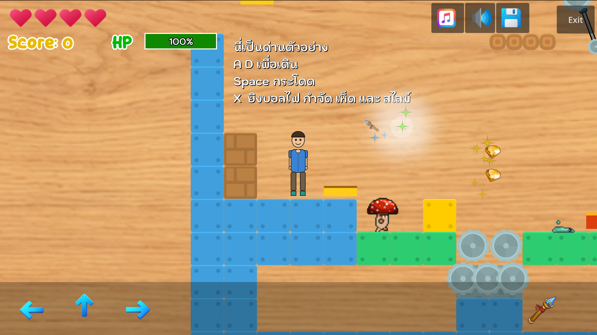

# 🍄 ผจญภัยป่าเวทมนตร์ (Mystic Forest Escape)
### สมุดบันทึกนักผจญภัย — Game Lab 4

*ไดอารีเล่มนี้เป็นของ...*

| | |
|---|---|
| 🖋️ ผู้จดบันทึก | มนัสนันท์ จันดาเวียง |
| 🔖 รหัสประจำตัว | 673380637-7 |
| 📜 วิชา | Computer Game Development, College of Computing, Khon Kaen University |
| 🧱 ต่อยอดจาก | [2D Platformer Starter Kit](https://github.com/AdilDevStuff/2D-Platformer-Starter-Kit) โดย AdilDevStuff |

<div align="center">

### 🗝️ [เข้าสู่ป่าต้องคำสาป — เล่นเลย](https://manatsanancha-sys.github.io/GameLab4/) &nbsp;|&nbsp; 🎞️ [ดูบันทึกการเดินทาง (Demo)](https://drive.google.com/drive/folders/12XrgxQdmw0Q6GZZ9ahRpEPAYJjzY_HVz?usp=sharing)

</div>

---

## Game Story

*"...ฉันเดินหลงเข้าไปในป่าลึกที่แผนที่ไม่เคยระบุไว้ ต้นไม้ที่นี่ผิดปกติ กิ่งก้านบิดเบี้ยวราวกับมีคำสาปคอยกัดกร่อน มีหอกไม้แกว่งไปมาราวกับมีชีวิต ใบมีดวางเรียงรายเป็นกับดัก และก้อนเห็ดสีแดงบางก้อน... ก็ลุกเดินได้เอง*

*ฉันไม่มีทางเลือกอื่นนอกจากเดินหน้าต่อไป เก็บแสงเวทที่ลอยอยู่ระหว่างทาง ต่อสู้กับสิ่งมีชีวิตประหลาด และตามหาประตูมิติที่จะพาฉันกลับบ้าน..."*

**โทนภาพ:** พิกเซลอาร์ตแฟนตาซี ผสมโทนสีเขียวป่าลึกและม่วงเวทมนตร์

---

## 🖼️ ตัวอย่างภายในเกม (Game Screenshots)

| 📋 หน้าเมนูหลัก (Main Menu) | 🕹️ บรรยากาศขณะเล่นเกม (In-Game) |
|:---:|:---:|
|  |  |

---

## เครื่องมือของนักผจญภัย

**การเคลื่อนไหว**

| ปุ่ม | ท่วงท่า |
|:---:|---|
| `A` `←` | ก้าวไปทางซ้าย |
| `D` `→` | ก้าวไปทางขวา |
| `Space` | กระโจนข้ามหุบเหว |
| `X` | ร่ายคาถาลูกไฟใส่ศัตรู |
| ปุ่มสัมผัสหน้าจอ | สำหรับผู้เดินทางบนมือถือ/เว็บ |

**เสบียงระหว่างทาง**

| ไอเทม | สรรพคุณ |
|---|---|
| 💎 เพชร/เหรียญ | สะสมคะแนนชื่อเสียง |
| ❤️ ยาแดง | ฟื้นฟูพลังชีวิต |
| 🌀 ไม้กายสิทธิ์ | เร่งความเร็วการเดินชั่วคราว |
| ✴️ แสงเวท | เพิ่มพลังกระโดดชั่วคราว |

**ผู้ร้ายในป่า**

เห็ดพิษ 🍄 · สไลม์ 🟢 · เห็ดเร็ว 🏃🍄 — เดินลาดตระเวน หันหลังเมื่อชนกำแพง ไล่ล่าเมื่อเจอผู้บุกรุก

**กับดักและกลไกในป่า**

เกียร์หมุน · หอกแกว่ง · แถวใบมีด · สระลาวา · กระดานเด้ง · แผ่นเลื่อน/ลิฟต์ · ประตูวาร์ป

---

## ระบบเบื้องหลัง (สำหรับผู้ที่อยากศึกษาต่อ)

```
Scenes/
├── Actors/     ตัวละครผู้เล่นและศัตรู
├── Levels/     ฉากแต่ละด่าน เมนู และหน้าจอ UI
├── Managers/   ตัวจัดการคะแนน เสียง และการเปลี่ยนฉาก
└── Prefabs/    ของที่ใช้ซ้ำ — กระสุน เหรียญ ไอเทม กับดัก

Assets/
├── Fonts/         ฟอนต์ที่ใช้ในเกม
├── Sound/          เพลงและเสียงเอฟเฟกต์
├── Spritesheet/    ตัวละครและ Tile ต่างๆ
└── Textures/       เอฟเฟกต์อนุภาค
```

**คุณสมบัติที่มีให้ปรับแต่งใน Inspector**
- **Player** — `double_jump`, `move_speed`, `jump_force`, `shoot_cooldown_time`, `bullet_lifetime`
- **Enemy Spawner** — `enemy_scenes`, `speed_range`, `respawn_time`, `max_instance`
- **Bullet** — `speed`, `lifetime`

**การบันทึกการเดินทาง (Save & Load)**
กดปุ่ม Save มุมขวาบนเพื่อบันทึกตำแหน่ง คะแนน ชีวิต และการตั้งค่าเสียง — กลับมาเล่นต่อได้ทุกเมื่อผ่านปุ่ม Continue

---

## สิ่งที่เพิ่มเข้ามาในการผจญภัยครั้งนี้

ตัวละครผู้เล่นออกแบบเอง (Skeleton2D พร้อมท่า Idle/Walk/Jump/Attack) · มอนสเตอร์เพิ่มอีก 1 ชนิด · กับดักลาวาและแถวใบมีดใหม่ · กระดานเด้ง แผ่นเลื่อน ประตูวาร์ป · ไอเทมเร่งความเร็ว/เพิ่มพลังกระโดด · ออกแบบพื้นด่านใหม่ทั้ง 4 ด่านพร้อม Collision Polygon · พื้นหลังเมนู/ฉากจบใหม่ทั้งหมด

---

## ผู้ร่วมเดินทาง (Credits)

**ดัดแปลงและพัฒนาต่อโดย** — 673380637-7 มนัสนันท์ จันดาเวียง

**ต้นฉบับพัฒนาโดย** — [AdilDevStuff](https://github.com/AdilDevStuff) · [2D-Platformer-Starter-Kit](https://github.com/AdilDevStuff/2D-Platformer-Starter-Kit)

**ทรัพยากรภาพ** — [Kenney.nl](https://www.kenney.nl/) · [craftpix.net](https://craftpix.net/) · [Ravenmore](https://ravenmore.itch.io/) · [Icons8.com](https://icons8.com)

**ทรัพยากรเสียง** — GDFXR (ปลั๊กอิน Sfxr สำหรับ Godot)

**ดัดแปลงเพื่อการศึกษาโดย** — College of Computing, Khon Kaen University

<div align="center">

*จบบทบันทึกไว้เพียงเท่านี้... ที่เหลือให้คุณไปเขียนต่อในป่าเอง*

</div>